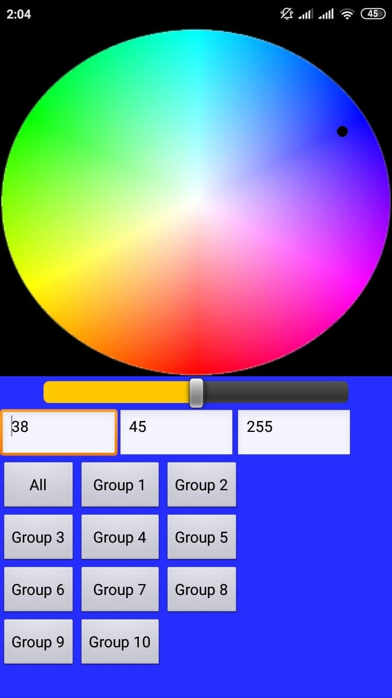

## esp8266-server-RGB-control

This project was developed using the platfromIO extension of Visual Studio Code. The [code](source/main.cpp) creates a web server hosted on an ESP8266 NodeMCU board and controls a WS2812B individually addressable RGB Led strip.

### HTTP Requests
The server listens and replies to the following url formats.
1. http://[address]/ -> (200, "text/plain", "Someone Connected!!")

2. http://[address]/RGB?Red=[RedValue]&Green=[GreenValue]&Blue=[BlueValue]&Group=[GroupIndex] -> Turns all the led's in group "GroupIndex" to the color (RedValue, GreenValue, BlueValue).

### App

The app has a really simple interface. It allows you to pick a color from the color wheel or select an exact RBG value from the text boxes. After that all you need to do is press any of the offered buttons and watch the led groups come to life. You can also adjust the intesity of every led through the slider. The slider feature uses the http request number two with a percentage of the RGB values based on the value of the slider (from 0 to 1).

### Setup
In order for the app to work properly you need to setup a static local IP for the ESP8266 board on your home router. 

### Notes
In order for the code to actually work, you need to do a few adjustments.
* Change the ssid and password variables in order for the server to connect to the local wifi network.

* Change the PIN variable to the pin number the data line is connected to.

* Change the TOTAL_LEDS variable to the total amount of leds in the led strip.

In the main [program](source/main.cpp) the "Groups" array specifies the groups, in which the led strip will be divided, that can individually be controlled.
